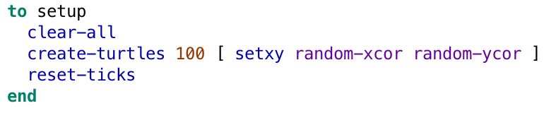
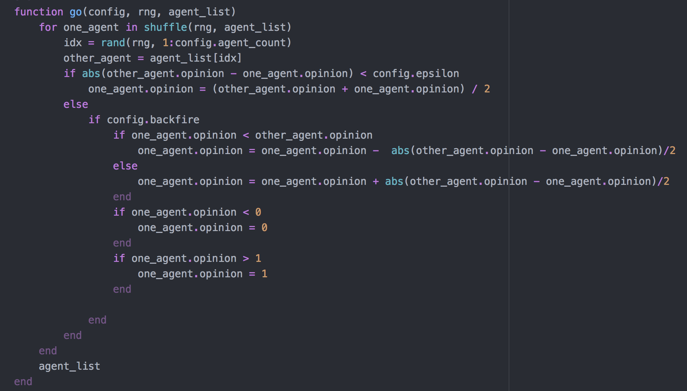
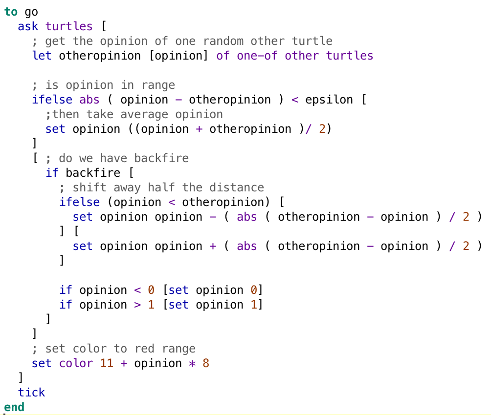
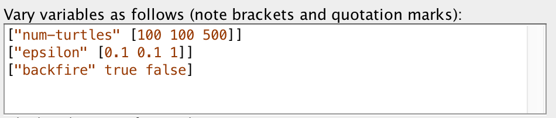
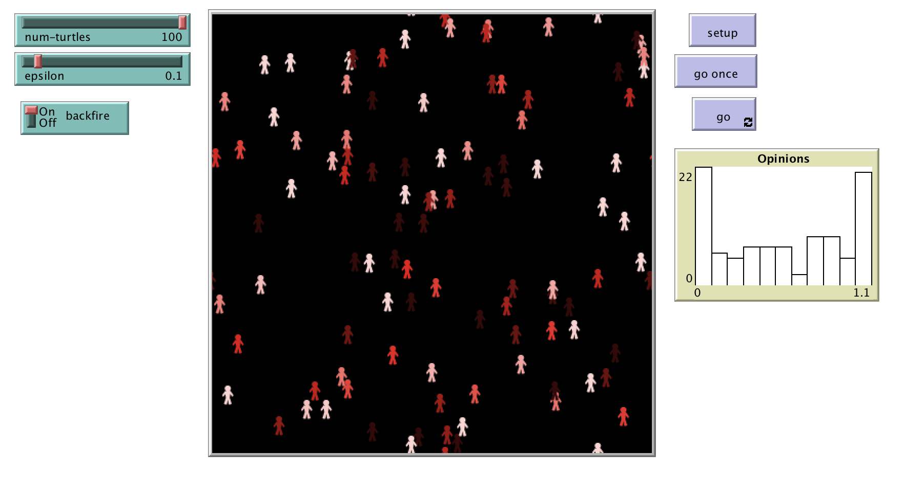
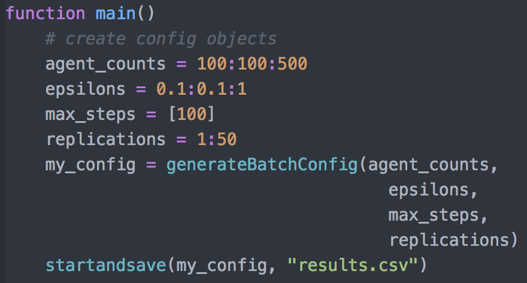

```{r knitr_init, echo=FALSE, message=FALSE, warning=FALSE, cache=FALSE, paged.print=TRUE}
## Global options
library(knitr)
#options(max.print="75")
opts_chunk$set(echo = FALSE,
	             cache = FALSE,
               prompt = FALSE,
               tidy = TRUE,
               comment = NA,
               message = FALSE,
               warning = FALSE,
               out.width = '100%'
               )
opts_knit$set(width = 100)

# Load required libraries
library(rmdformats)
library(tidyverse)
library(cowplot)
library(tinytex)
# add libraries here

# Add libraries to cite here:
pkgs <- c("knitr", "tidyverse", "rmdformats", "kableExtra", "scales", "psych", "rmdtemplates")
rmdtemplates::write_bib(pkgs)
```


<!--- Ca. 1/2 bis 1 Seite --->
# Introduction
Today, we live in a world, that is more complex than years ago. We are almost always and everywhere on the mobile Internet, using cloud storage or cloud computing and AI technologies such as deep learning. Also, when humans interact with each other or with digitized technology we speak of complex systems. The interaction of humans in such systems, for example in opinion-forming processes, leads to consequences that we cannot yet overlook or understand. An important component of socio-technical complex systems are single individuals that appear as human-in-the-loop [@Valdez2018human]. To look at people, their interactions and the resulting overall behaviour, we need suitable methods, such as simulations. Simulations make it possible to observe the resulting overall system or the resulting behaviour by representing individual processes, procedures and behaviour. In addition, simulations make it possible to identify tipping points that lead to a different outcome of the overall system. 

Agent-based models are a form of simulation. As the name implies, they always consist of agents. In addition to the agents, the environment in which the agents are located and with which they interact is also modelled. However, agents can be designed in different ways, depending on the context to be considered. For example, agents can be more than just people interacting with each other. If, for example, traffic jams are to be considered, cars are used as agents, if it is considered how possible forest fires can be avoided, the agents are trees. The agents differ not only in their form, but also in several other dimensions. For example, the agents can be completely or to a lesser extent autonomous. Their interests and character traits can also be different. For example, they can act selfishly or in favor of the totality of all agents. They can be outgoing or prefer to remain separate. Some agents are able to learn from their experiences or observations. Agents can also be of varying degrees of complexity [@Conte2011]. Despite the potential complexity of agents and the possibility to model them in very different ways, most agent-based models tended to focus on simple, local rules [@Epstein2006]. Furthermore, there is a view that the simulations are mainly randomly implemented to run on a computer [@Gilbert2005].


Various frameworks have been developed for creating agent-based models. The most established language or program of these is Netlogo [@Wilensky1999]. But while Netlogo was authored by Uri Wilensky in 1999, the spread of the Internet also resulted in the evolving of different programming languages [@Valdez2018human]. Thereby more languages can be used to create agent-based models. So far, it has not been considered which language is actually best suited for creating agent-based models. Therefore, in this study we investigate whether Netlogo or Julia is better suited for creating agent-based models. 

<!--- Ca. 3 bis 4 Seiten --->
# Related Work
In this study, using agent-based modelling we consider opinion formation processes, thus we look at a complex system. We want to know, whether it is possible to create an agent-based model with the programming language Netlogo and the programming language Julia. We further consider, how the two languages differ, which are the strenghths for creating agent-based models of each programming language and which are the disadvantages. Contentwise, we built a bounded rationality model to simulate opinion formation. 

Therefore, we explain, which aspects lead to complexity, we introduce the method agent-based modelling and the two programming languages Netlogo and Julia. Besides, we eplain what is known in theory about opinion formation or the spread of information. 

## Complexity and how to model it
When examining opinion-forming processes, we look at a complex system. Such complex systems can be divided into several ontological levels or interacting subsystems on a micro- or macro-level [@Conte2012] We first have to look at how systems are structurally designed in order to deduce what leads to complexity [@Valdez2018human]. Further, complex systems lead to emergent phenomena. These complex systems and emergent phenomena are difficult to understand, because while it is easy to observe the individual system components, the resulting overall system cannot be considered as the sum of its parts. Instead, understanding the system behavior requires more than understanding the individual parts of the system [@Valdez2018human].  

### Complex vs. complicated
When we look at complex systems, we do not necessarily mean complicated systems. A system consisting of components can initially be both complicated and complex. However, while the term complicated is always related to human understanding, the term complex is not necessarily so. If something is complicated, such as a mathematical differential equation, this means that it is difficult for us humans to understand. To be complex at the same time, the equation would have to contain many small parts. However, it is also possible that an equation consists of few parts and is therefore not complex, but is nevertheless complicated to understand. The two terms therefore both refer to a system consisting of components, but mean different aspects of the system and a system which is complicated does not necessarily have to be complex system and vice versa. A complex system consists of many sub-components, whose interactions make it difficult to predict the behaviour of the system. The number of components as well as the complicated interactions of the parts are considered complex [@Waldorp1992],  [@Byrne1999]. Another characteristic of complex systems, which is particularly important for our study, is that complex systems are always dynamic. If a system consists of many parts, but does not show dynamics but remains static, it is never complex. It is easy to investigate it comprehensively [@Valdez2018human].

### Emergence
Typically, we look at individual components of a system. From these subcomponents we then often infer the behavior of the overall system. However, as Aristotle said, the whole is more than the sum of its parts, and it is therefore not really correct to observe only the components and conclude on the overall behavior. However, it is problematic that we can usually observe and understand individual components or individual behavior, but the overall behavior is often more difficult to observe. If the interaction of the individual components results in a system that cannot be described by the sum of the individual components, we speak of emergence. 

With agent-based models we can make emergent behavior visible. We can model the individual agents and design them according to individual rules that they follow at the micro level. When the agents interact with each other and with their environment, unpredictable social patterns, i.e. emergence, occur [@Bruch2015]. 
<!--- Hier könnte ich z.B. noch Vogelschwarm-Beispiel bringen
--->

## Agent-based modelling
To analyse complex systems we need a suitable approach, such as simulations, which enable to model the individual parts of a system and thus make the overall behavior visible. For the simulation of complex systems, agent-based models are very well suited [@Epstein2007]. 

Agent-based models always consist of the agents or individuals and the environment in which the agents reside [@Bonabeau2002Agentbased]. They are neither a representation of reality, nor fully realistic or even complete. Instead, they show a simplified reality. Nevertheless, agent-based models show behaviour on an individual level close to reality. By mapping the individual behavior, the behavior of the overall system can then be qualitatively observed [@Rouchier2008]. Agent-based models are well suited to replicate data and present the results to non-experts [@Kiesling2012]. The use of a method always requires an evaluation of the method. Evaluating agent-based models is not easy. In order to evaluate them, independent replicating and comparing with other model as well as a validation are necessary [@Rouchier2008].

The basis of agent-based modeling is the single agent or the individual. This agent is modelled programmatically as a template. In simulation, due agents make their own decisions based on how they perceive the environment in which they are situated. 
The perceptions of an agent usually determine the behavioral intent of the agent. If the agents are in a social network, as in our model, they influence their neighbours in the next iteration by their behavioural intention or the behaviour they show. To determine the probability of organizational acceptance, we analyze the results of several agent-based simulations.

A simple way to create agent-based models is to use software toolkits developed for the creation of simulations. These include the Netlogo toolkit considered in this study. With the use of such toolkits, it is easy to formulate the behavior of the individual agents. They also usually contain some useful interfaces. The interfaces allow to visualize the simulation states, interact with the simulation parameters and export the simulation results. In addition, they usually contain a batch mode. This is used to run a large number of simulations. Optimization strategies, such as genetic algorithms, help to find the most suitable parameters [@Calero2019].

 
To create agent-based models, Netlogo [@Wilensky1999] is the language most commonly used. Nevertheless, there are some other programming languages that are also suitable for creating agent-based models and that seem to be partly more intuitive, at least for people with programming experience. Therefore, in this study we compare two programming languages with respect to their suitability for creating agent-based models.

## Opinion formation and bounded rationality
In describing social phenomena, social scientists traditionally have tended to employ causal modeling techniques.
That is, phenomena are explained by causally linking different variables. 
However, when describing phenomena like opinion formation in groups, repeated interactions between people appear to be more influential than static variables [@Smith2007;@Vespignani2012].
Analytical models for the process of opinion formation therefore focus on group dynamics.
They employ agents whose opinion develops over time as they interact with other agents whose opinion may be similar or different from their own.
Computer simulations can be used to explore how varying different parameters, like the number of agents or the way agents interact with each other, will affect the distribution of opinions.
@Hegselmann2002 give an overview over how different models mathematically describe the process in varying complexities.
One distinction between models is how opinion is represented.
For continous opinion dynamics, the assumption is that opinions are one-dimensional in that they can be described as a  number.
The smaller the difference between two numbers is, the closer are the opinions they represent.
Another main distinction between the models is the way in which other agents' opinions influence one agent's own opinion, i. e., the weight which one agent puts on others' opinions.
In the easiest case, this weight is modelled as constant, but it might also be modelled as differing, e.g., dependent on the susceptibility of each agent or as dependent on the disparity between two agents' opinions.
This last case can be described by so-called bounded confidence models which have been proposed by both @Hegselmann2002 and  @Nadal2002.
With a bounded confidence model, the agent will only interact with agents whose opinion is relatively close to their own.
To put it another way, they will only put weight on similar opinions.
The treshold for similarity is defined as the bounds of confidence epsilon which, assuming continous opinion dynamics, represents the maximum difference between the numbers ascribed to the opinions where the other's opinion will still be considered.
An extension to this model of bounded confidence is something we call the backfire effect.
As described by @Jager2004, if an agent interacts with another agent whose opinion is very dissimilar, they will not just ignore that opinion.
Instead, they will shift their opinion to be even further away from the other agents' dissimilar opinion.
To summarize, for a bounded confidence model with backfire effect, an interaction between two agents has three possible outcomes:
1. If the difference between their opinions is smaller than or equal to a certain confidence interval epsilon, their opinions will converge.
2. If the difference between their opinions is bigger than or equal to a certain backfire threshold (which might be equal to epsilon), their opinions will diverge.
3. If epsilon and the backfire threshold are not equal and the difference between their opinions is between epsilon and the backfire threshould, their opinions will remain unchanged.

<!---Commented this out, because it's not really relevant without discussing the empirical underpinnings. Kept it just in case.
When conducting simulations based on a bounded confidence model, varying the characteristics of epsilon will drastically influence the distribution of opinions [@Hegselmann2002].--->

<!--- Ca. 3 bis 4 Seiten --->
# Method
Using two different programming languages (Netlogo and Julia language), we created two identical agent-based models that simulate opinion formation. Since our primary aim was to find out whether agent-based models could be implemented equally well in the two programming languages, we chose the most basic model of opinion-forming: bounded rationality.

We built the agent based models using the Atom editor of the Julia programming language and version 6.0.4 of the multi-agent programming language Netlogo, which was developed by Uri Wilensky [@Wilensky1999]. For the following analysis of the results we used R Markdown. 

## First steps in agent-based models 
While we have previously (see chapter 2) explained what agent-based models are and what they are used for, we following describe how they are structured programmatically. We start with the most basic components. 

An agent-based model usually contains a "setup" and a "go" procedure. The "setup" procedure defines a kind of basic state at the beginning of the simulation. The "go" procedure then specifies what happens in a single step of the simulation.

In Netlogo the "setup" procedure usually looks like in Figure \@ref(fig:setup). In Netlogo, procedures always start with "to" and end with "end". Clear-all makes the world go back to its initial, empty state. For example, if colors were assigned to the spots where the agents are located, they will now turn black again. Create-turtles creates the specified number of turtles, here 100. The turtles usually start at the origin, i.e. in the middle of patch 0.0. The code in the square brackets after create-turtles here indicates that the turtles start at a random x and y coordinate. The square brackets could also be used to create other commands for the agents. Reset-ticks makes sure that the tick counter starts. Once this code is created, the simulation starts in the interface by clicking the "Setup" button. In Julia the setup includes an additional configuration. 

Additionally, the agents and their environment are designed before the simulation starts. For example, properties are assigned to the agents and the agents' environment is designed to resemble the reality of what is being observed. In our case, the agents do not have specific properties and the environment is also in its default state. 
<!--
\begin{lstlisting}[caption = The setup method in NetLogo]
to setup
  clear-all
  create-turtles 100 [ setxy random-xcor random-ycor ]
  reset-ticks
end
\end{lstlisting}-->


```{r setup, out.width="1\\linewidth", include=TRUE, fig.align="center", fig.cap=c("Setup procedure in Netlogo"), echo=FALSE}

```

## Bounded rationality model
Since our primary goal was to compare the two programming languages with each other, we designed the parameters of the Netlogo model and the Julia model the identical way. Thus, we increased the comparability of the results of both models and reduced the complexity as much as possible. In the beginning of our bounded rationality model, we defined the maximum number of agents, the maximum steps of the simulation, the seed, an epsilon as well as whether a backfire effect takes place or not. The epsilon indicates how different the opinions of two people can be, so that they still include the other person's opinion in their opinion formation. We further defined from the beginning, that each agent has an (floating) opinion between 0 and 1. In each simulation step, every agent compares his opinion with the opinion of an other agent. For example, if Anna compares her opinion with Ralf and the distance between the opinion of Anna and Ralf is smaller than the defined epsilon, then the two converge in their opinions. Additionally we defined in the beginning, whether an backfire effect takes place or not. When the simulation includes the backfire-effect and Ralf's opinion deviates more than the epsilon indicates from Anna's opinion, then the opinion of Anna distances from the opinion of Ralf. 

While in Netlogo the parameters for the simulation runs are determined in the Behavior Space (see Fig. \@ref(fig:nbehspc)), in Julia the initial settings are determined in the "main" procedure, what can be seen in Figure \@ref(fig:main).  

As can be seen in Figure \@ref(fig:main) and \@ref(fig:nbehspc), we set the number of agents 100 to 500 in increments of hundreds (100:100:500). We varied the epsilon between 0.1 and 1 in increments of 0.1 and varied between with backfire-effect and without (true/false). We set the maximum number of steps to 100. 


### Go procedure 
Here we compare the "go" procedures, so what happens in each step of the simulation, of Netlogo and Julia (see Fig. \@ref(fig:goj) and Fig. \@ref(fig:gon)). Both codes look similar. In Netlogo (see Fig. \@ref(fig:gon)), the procedure starts by adressing the agents (ask turtles). The next line of code says, that the adressed agent gets the opinion of one random other agent. The subsequent lines of code determine what happens to the (new) opinion of the agent. If the other agent's opinion differs less from his own opinion than the epsilon (see above), the agent assumes the average opinion of the two opinions. This means that the opinions of the two agents are added together and divided by two. However, if the opinion of the other agent is further away than the respective (may vary) epsilon indicates, it checks whether the backfire effect exists. If the simulation is set to show that the effect exists, the opinion of the agent is half the distance away from the opinion of the other agent. At the end, the code indicates that the color of the agents depends on the opinion. However, this is only for illustration in the interface. Before the procedure ends, one more "tick" is counted as one time unit. 
```{r goj, out.width="1\\linewidth", include=TRUE, fig.align="center", fig.cap=c("Go procedure in Julia"), echo=FALSE}

```

The "go" procedure in Julia is very similar. One difference is that the procedure is passed a configuration (config) at the beginning . Furthermore, an agent list with the agents in random order is passed. 
```{r gon, out.width="1\\linewidth", include=TRUE, fig.align="center", fig.cap=c("Go procedure in Netlogo"), echo=FALSE}

```

## What do we compare
To find out whether both programming languages are euqually suitable to simulate our bounded rationality model, we look at severeal measurable criteria. These criteria include the outcomes and performance of both models. They further include how many lines of code are necessary to program the simulation. Another aspect, that we take into consideration, is, if learning Julia and Netlogo is equally difficult. For this aspect we consider both computer scientists who are familiar with other programming languages and a person who has no previous experience with programming languages. We further compare the explorability and scalability of both languages.

<!--- Ca. 4 bis 5 Seiten --->
# Results
Before we present the results of our bounded rationality model, we reflect on the extent to which the two languages Julia and Netlogo are suitable for developing agent-based models and how easy it is to get started with the two languages.

## Getting started with both languages
Both Julia and Netlogo are languages that address both researchers and beginners. 
Netlogo is derived from Logo a language that is aimed at children to lern programming. 
The core aim of Netlogo is agent-based modeling and it has several primites for this purpose.
Julia is aimed at scientists that require both performance and understandable code. 
The core aim of Julia is to make code fast, reusable and easy to understand.
This quick introduction by no means covers the breadth of both of these languages, it aims to provide a high-level overview.

### Netlogo
Netlogo as a modelling language for agent-based modeling is very well suited for beginners wanting to use agent-based modeling. It comes with a rich variety of example models that users can explore and provides a graphical user interface and a graphical user interface toolkit to create models that even non-experts can use. Thus, Netlogo is visually appealing and the interface enables users to create and test agent-based models and also simplifies the initial creation of a model. Figure \@ref(fig:interface) shows the Interface of our simulation. 
Netlogo also provides methods for inspecting the model (reporters and visualizations) and for exploring the impact of model parameters on system behavior (i.e. the *behavior space* feature, which allows the user to run any number (usually several hundred) of simulations). The latter allows turning of the GUI for faster simulations (see Fig. \@ref(fig:nbehspc)).

```{r nbehspc, out.width="1\\linewidth", include=TRUE, fig.align="center", fig.cap=c("Behavior Space in Netlogo"), echo=FALSE}

```

Netlogo provides immediate visual feedback for the user of an agent-based model and has easy to understand primitives that allow modelling of agent behavior, agent interactions, and agent-environment interactions. It provides an API for extensions, to allow other researchers to complement the functionality of Netlogo.

```{r interface, out.width="1\\linewidth", include=TRUE, fig.align="center", fig.cap=c("Interface of our bounded rationality model in Netlogo"), echo=FALSE}

```

Overall, it is very easy to start using Netlogo. However, creating complex models requires understanding of usage contexts in the language. People coming to Netlogo with a computer science background may find some of the language concepts unintuitive and clunky. Several of the authors of this paper have found Netlogo syntax to be confusing and unecessary simplistic. 


<!--- ## Netlogo
Different platforms to create agent-based models exist. Netlogo consists of a programming language, which was derived from the earlier Logo language and a set of libraries, as well as a programming environment.Ca. 

Netlogo also provides a graphical tool for quickly constructing interfaces for running agent-based models.

Netlogo is visually appealing because the user is provided with a user interface to create and test an agent-based model. In addition to the user interface that simplifies the initial creation of a model, Netlogo also includes a batch mode that allows the user to run any number (usually several hundred) of simulations.
--->

<!--- ### Interface
An advantageous feature of Netlogo, is that the platform contains an easy to use, clear and attractive interface. Figure \@ref(fig:interface) shows the Interface of our simulation. The interface shows a spatial 2D view of the model environment. For Netlogo, this environment is a square grid (there are other platforms that support hexahonal grids, such as Mason and Repast). The Netlogo user can add further elements to this view. These include buttons for setting the model parameters and diagrams that can be used to monitor the results. The added elements can be moved anywhere on the interface. 

is partly due to the fact that the platform's interface makes it easier to get started with the programming language.   Figure \@ref(fig:interface) shows the Interface of our simulation. The interface shows a spatial 2D view of the model environment. For Netlogo, this environment is a square grid (there are other platforms that support hexahonal grids, such as Mason and Repast). The Netlogo user can add further elements to this view. These include buttons for setting the model parameters and diagrams that can be used to monitor the results. The added elements can be moved anywhere on the interface. --->

### Julia
Julia was initially introduced by a group of computer scientists and mathematicians at MIT under the direction of Alan Edelman. Compared to other programming languages Julia is considered fast, easy to learn and use and it is open source. <!---Julia has a fast numerical speed because it is based on a LLVM (Low Level Virtual Machine) based JIT (Just-in-Time) compiler.---> Further advantages of Julia compared to other programming languages are that it supports parallelization or practical functional programming and can be easily combined with other programming languages and libraries. Finally, there is already a group of active users who develop packages (and thereby add functions to the base language; as of April 6, 2019, there are 1774 registered packages). 

Julia is not a language specifically written for agent-based modeling. Julia is a general purpose programming language that uses a just-in-time compiler to generate low level machine code (using LLVM). This means there is no native support for typical agent-based modeling tasks. There is a library for agent-based modeling called `agents`. However, our intention here was to compare the programming language itself without the use of a library. It is unclear whether the library is going to be maintained in the future, whereas Julia's support is not likely to expire soon.

This means the user has to design all tools for agent-based modeling themselves. However, this is not necessarily very hard. It depends on the complexity of the model. When this barrier has been overcome, writing a model becomes easier. The language is very similar to python 

```{r main, out.width="1\\linewidth", include=TRUE, fig.align="center", fig.cap=c("Main procedure in Julia"), echo=FALSE}

```

## Comparison of agent-based modeling results of Julia and Netlogo
Following, we present some exemplarily results of our bounded rationality model. We also show, if the model created with Netlogo showed the same or different results as the model created with Julia. Based on these results, we compare the two considered programming languages and show their advantages and disadvantages.

### Opinion change of agents
Following we consider, how the opinion of the agents changed during the simulation steps of the bounded rationality model with and without backfire effect. At this point we do not distinguish between the two programming languages used. 

```{r results,child='analysis.Rmd', eval=TRUE}

```

We use four examples (see Fig. \@ref(fig:examples)) to illustrate how the agents change their opinion during the simulation and how different the opinions look at the end of the simulation. As can be seen at the top left of Figure \@ref(fig:examples), one possible outcome is that the opinions of the agents diverge completely and only two extreme opinions are formed. After less than 15 simulation steps, every agent has either opinion 0.00 or opinion 1.00. In this example, the epsilon is low and the backfire effect takes place. 

In comparison to this example, in the third example (bottom left) no backfire effect takes place. In both examples, the epsilon is 0.1. Comparing the two examples, it becomes clear that the backfire effect increases the divergence of opinions. While in the first example two clear opinions quickly establish, in the third example there are more different opinions for a longer time. After 20 simulation steps, two groups of agents form whose opinions are similar to each other. Nevertheless, even after 30 simulation steps, these agents still have similar opinions, but not one uniform opinion. 

In example 4 (bottom right), also no backfire takes place. Here, the different opinions converge to a consensus of opinion. After around 20 simulation steps each agent has the opinion 0.5. 

In contrast, in example 2 (top right) no majority opinion develops, but several groups with the same opinions form. In this example, the epsilon is higher than in the other examples, which leads the agents to accept opinions that differ more from their own than in the other examples. 
 
### Influence of programming language, epsilon and backfire on opinion count
After we looked at the opinion formation of the agents itself, we now consider, whether the epsilon, if the backfire effect takes place or not and the programming language has an influence on the existence of different opinions. To look at the influence of the enumerated factors, we consider (see Figure \@ref(fig:allruns)) how many different opinions exist (y-axis). We further consider the standard deviations of the opinions (color) to analyse how different the opinions are.

As Figure \@ref(fig:allruns) shows, if the epsilon is higher than 0.55, practically all agents have only one opinion (sd = 0.0), regardless of whether the backfire effect takes place or not and which programming language is used. When the epsilon is lower than 0.55 and the backfire effect takes place, there are two opinions among the agents that diverge to the two extremes of opinion (sd = 0.5). In comparison, when the epsilon is lower than 0.55 and no backfire effect takes place, the agents have more different opinions, but the standard deviations of the opinions are lower (less bright) than in the simulations with backfire effect. The lower the epsilon is, the higher is the amount of opinions. Comparing the two programming languages, the amount of different opinions is a bit higher when NetLogo is used, but the difference is small. Overall, the two programming languages showed almost the same qualitative results. As Table \@ref(tab:table) shows, the quantitative comarison of both languages showed, that except of three simulation runs, the t.test wasn´t significant. Thus the languages showed the same results.

## Comparison of Julia and Netlogo after our bounded rationality simulation
When comparing both programming languages to create an agent-based model that simulates the bounded rationality model, Julia  proved to be a faster language. The whole simulaton took only 82.23 seconds, whereas the Netlogo simulation took 36 minutes. While the model calculation in Julia is much faster, Netlogo required less than half the lines of code. To write the bounded rationality model in Julia 97 lines of code were necessary, in Netlogo only 44 lines of code were necessary.

When we consider how difficult it is to learn the two programming languages, we also have to take into account the previous knowledge of the users. Thus Netlogo proved to be a language that is easier to learn for people without programming skills. In contrast, people with previous programming skills reported, that it is easier to learn Julia, because it is more similar to other already used programming languages (for example Python). 

An advantageous feature of Netlogo, is that the platform contains an easy to use, clear and attractive interface.These interface makes it easier to get started with and learn the language for people without previous programming experience. The interface offers the user direct feedback, as the simulation runs visibly if he has written the code correctly and also immediately reports back error messages if the code is wrong. In addition, the interface allows the user to try out and change various things in the process. 

Also, the fact that there is already a large library of existing agent-based models in Netlogo, since the language is used exclusively for this method, makes it easier to use, since existing models can be built upon or users can orient themselves on them. 

In addition to the interface, the Logo programming language, which Netlogo uses, is also easy to use because there is only a manageable number of structurally different commands and users can quickly get a feel for which procedures and functions always need to be set when creating agent-based models.  

<!--- Ca. 1 Seite --->
# Discussion
In our study, no language turned out to be the perfect programming language for creating agent-based models, but the choice of language seems to be a trade-off between various advantages and disadvantages and also between different potential users and use cases. 

For people who have never used a programming language before and are not supported by people with previous programming experience, the entrance to the Netlogo language is certainly easier than to the Julia language. Likewise, starting with Julia is easier for people with programming experience, because they already know, how the language is probably organized. It can be assumed that modelers who are already very familiar with the language they use also develop more complex simulations than simulation based on simple rules [@Epstein2006]. So less effort in learning a language can certainly increase the complexity of the models.  

One other aspect, that could be taken into account, is the time, that is needed to run the simulation. Here Julia turned out to be much faster. But, in many research areas or for many research questions it does not really matter, whether the language is really fast. One aspect, that is probably more important is, that very big simulations in Netlogo require high computing power and that the computers sometimes crash, making it impossible to calculate the model In this case Julia makes it possible to calculate the simulation without any problems. 

Of course, we have only focused on one very simple bounded rationality model, so that we would have to create further simulations with both languages to be able to make statements about the generality. 

Historically, the basis for analytical opinion dynamics models is given by psychological research and philosophical theories about social influence (e.g., [@French1956];[@Wagner1978]).
And simulations based on those models have frequently proven to reliably enough reproduce real-life phenomena [@Vespignani2012].
However, as @Flache2017 argue, there is a lack of recent empirical studies reassessing and replicating the assumptions underlying those models, let alone studies examining the size of epsilon in real-life interactions.
In future research, finding a way to link analytical opinion dynamics models with contemporary empirical psychological findings would be desirable.

<!--- Ca. 1/2 bis 1 Seite --->
# Conclusion and outlook
The results of our research have shown that, although Netlogo has been established for a longer time, both programming languages are well-suited to create agent-based models. 
Comparing the two languages, we could not find one perfect language, but each laguage is the better choice for creating an agent-based model in some aspects. 
The decision for a programming language depends on different trade-offs (previous experience vs. support; time to create the model vs. time used for simulation run; nice interface vs. higher functionality). 
In the end, however, it does not make sense to decide in favor of one language against the other, but to take advantage of both languages and thus use Netlogo for prototyping and Julia for larger simulations based on these prototypes. 

With this study we compared Julia and Netlogo to create a very simple bounded rationality model. In the future, we would like to extend this comparison by using both languages for more complex simulations. We further plan to pursue with studies, that combine both languages. 

### Acknowledgements {-}
This research was supported by the Digital Society research program funded by the Ministry of Culture and Science of the German State of North Rhine-Westphalia.

```{r r_citations, eval=TRUE, include=TRUE, results="asis"}
rmdtemplates::line_cite(pkgs) # This creates a single line citing all packages
#rmdtemplates::list_cite(pkgs) # This creates a "thightlist" of all packages 
```


# References


